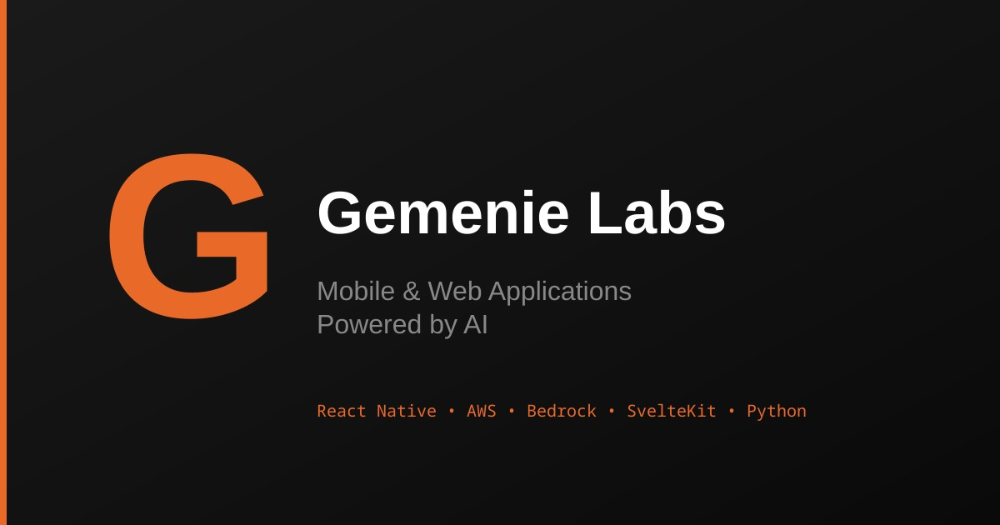

<div align="center">



Minimal company page for Gemenie Labs

[Site](https://gemenielabs.hatstack.fun)

---

</div>

Minimal company page for Gemenie Labs
## Structure

```text
├── frontend/          # SvelteKit static site
│   └── src/lib/data.ts  # Edit content here
├── backend/           # AWS Lambda + SES contact form
│   ├── template.yaml  # SAM template (Python 3.13)
│   ├── contact.py     # Lambda handler
│   └── scripts/deploy.sh
└── tests/             # Vitest unit tests
```

## Commands

```bash
npm run dev      # Start dev server
npm run build    # Build frontend
npm run check    # Lint + type-check + test
npm run test     # Run tests only
npm run deploy   # Deploy backend (updates frontend .env)
```

## Deploy

### Backend (Contact Form)

Requires AWS CLI, SAM CLI, and verified SES email addresses.

```bash
npm run deploy
```

The script will:
1. Prompt for AWS region, email addresses
2. Build and deploy Lambda + SES
3. Update `frontend/.env` with the API URL

### Frontend

After backend deployment, rebuild and deploy to any static host:

```bash
npm run build
# Deploy frontend/build/ to Netlify, Vercel, S3, etc.
```

## Edit Content

Update `frontend/src/lib/data.ts` to modify:
- Company info
- Projects (with demo credentials)
- Social links
